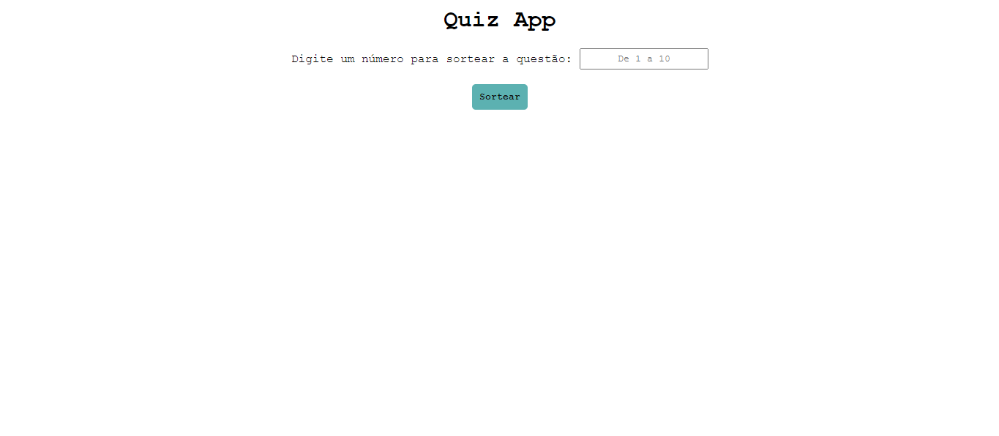

<h1 align="center">Quiz Game</h1>

Usando os conhecimentos de HTML, CSS e Javascript, fui capaz de desenvolver esse app que traz um quiz com, atualmente, 10 perguntas. Cada questão tem uma única resposta, e cada questão é única. Futuramente, viso trazer mais questões, mais complexidade e diversidade para o jogo, e talvez implementar uma dinâmica de "Torre de questões", não poderá errar se não volta do começo (para o futuro apenas)

 

  

 
